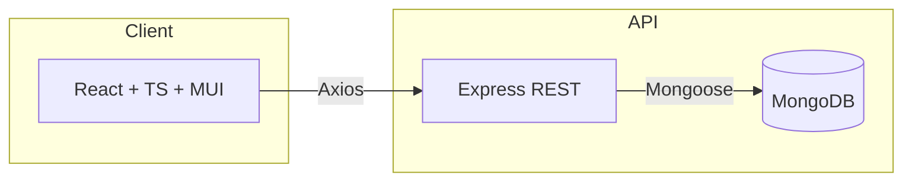

# AfriGest — Dossier Investisseur

## 1) Executive summary
AfriGest est une plateforme unifiée de gestion commerciale et e‑commerce pour PME/ETI africaines. Elle connecte le back‑office (ventes, inventaire, utilisateurs, comptabilité légère) à une vitrine e‑commerce publique, pour vendre en ligne sans friction.

- Proposition de valeur: une suite simple, moderne et mobile‑first qui réduit les coûts (outil unique) et accélère la mise en marché (catalogue → vente en ligne en heures, pas en semaines).
- Modèle: SaaS par abonnement avec paliers (Free → Enterprise) + add‑ons (paiements, logistique).
- Demande de financement: 300 k$ pour 18 mois (produit, go‑to‑market, partenariats paiements/livraison) avec objectifs d’ARR et d’adoption réalistes.

## 2) Problématique et opportunité
- **Problème**: Les PME africaines jonglent avec des outils fragmentés (stock, ventes, e‑commerce, comptabilité). Résultat: erreurs, doubles saisies, ruptures, pas de visibilité temps réel.
- **Opportunité**: La digitalisation accélère (mobile money, social commerce). Proposer un outil intégré et localisé, compatible mobile, est différenciant face aux solutions lourdes ou non adaptées au contexte local.

## 3) Marché (TAM/SAM/SOM) — hypothèses réalistes
- **TAM** (Afrique, PME formelles avec besoin de gestion/vente) ≈ 5 M d’entreprises. Hypothèse: 20 % adressables par un SaaS back‑office + e‑commerce léger → 1 M.
- **SAM** (pays cibles initialement: ex. Côte d’Ivoire, Sénégal, Cameroun, Guinée) ≈ 200 k entreprises.
- **SOM** (objectif 3 ans) ≈ 10 k comptes payants, ARPA moyen 18 $/mois → ~2,16 M$ ARR. Hypothèses prudentes: conversion 3–5 %, churn < 3 %/mois après onboarding.

## 4) Produit
- **Back‑office**: entreprises, boutiques, utilisateurs & rôles, produits/stock, ventes, notifications, rapports.
- **E‑commerce public**: catalogue, panier, commande, synchronisé au stock interne.
- **Permissions & sécurité**: rôles (super_admin, company_admin, dg, store_manager, employee, accountant, store_accountant), authentification JWT.
- **Tech**: React + TypeScript (MUI), Node/Express, MongoDB. API centralisée `client/src/api/client.ts`.

Références clés du code:
- `client/src/components/companies/CompanyDetails.tsx` — fiche entreprise (KPIs, e‑commerce, abonnement, actions super admin).
- `client/src/components/inventory/InventoryManagement.tsx` — inventaire & produits.
- `server/routes/companies.js`, `server/routes/inventory.js`, `server/routes/ecommercePublic.js` — endpoints principaux.

## 5) Différenciation
- **Couplage natif e‑commerce + back‑office** (mise en vente web en un clic, sans intégrations lourdes).
- **Orienté PME africaines**: compatible mobile, prêt pour paiements locaux, expérience simple pour non‑techniciens.
- **Modularité**: add‑ons paiements/livraisons/analytics activables par palier.

## 6) Traction et preuves (si pré‑lancement)
- Prototype fonctionnel et démo bout‑en‑bout (catalogue → commande publique → visibilité admin).
- Jeux de tests: intégration (propositions, rôles), sécurité (élévation de privilèges), API globale. Voir `tests/`.
- Pipeline de pilotes: 5–10 PME ciblées via partenaires locaux (commerçants, fédérations, cabinets).

## 7) Modèle économique (pricing)
- **Free**: 1 boutique, 5 utilisateurs, fonctionnalités de base; marque AfriGest visible.
- **Basic** (~9 $/mois): 2 boutiques, 20 utilisateurs, inventaire avancé, e‑commerce basique.
- **Premium** (~19 $/mois): 5 boutiques, 100 utilisateurs, rapports avancés, add‑ons limités.
- **Enterprise** (sur devis): ≥ 5 boutiques, ≥ 100 utilisateurs, SSO, SLA, intégrations spécifiques.
- **Add‑ons**: passerelles de paiement locales, livraison (frais/commission), analytics avancés.

Hypothèses financières:
- ARPA moyen initial 12–20 $/mois. CAC 25–60 $. Payback < 4 mois après la 2e année avec canaux organiques/partenariats.

## 8) Go‑to‑Market
- **Partenariats**: agrégateurs de paiement, opérateurs de livraison urbaine, cabinets d’expertise comptable.
- **Canaux**: social + contenus (guides pratiques), webinaires, influence B2B local, places de marché partenaires.
- **Mécaniques produit**: templates de boutique, onboarding 15 min, import CSV, essai 14 jours, parrainage.

## 9) Concurrence
- **Outils globaux** (Shopify, WooCommerce + plugins): forts en e‑commerce mais back‑office PME non intégré ou lourd à paramétrer.
- **ERP/Pos locaux**: parfois on‑prem, coûts d’intégration élevés, UX datée.
- **Avantage AfriGest**: démarrage ultra rapide, coût total faible, localisation, et couplage natif BO + e‑commerce.

## 10) Roadmap 18 mois
- T1–T2: paiements (mobile money/carte), livraison (API), catalogue enrichi (images, variantes), analytics simple.
- T3: app mobile (PWA), promotions, intégrations comptables légères.
- T4: marketplace partenaires, multi‑devise, modules fiscaux locaux.

## 11) Architecture & Sécurité
- **Front**: React/TS, MUI. **Back**: Node/Express, JWT, Mongoose.
- **Sécurité**: validations `express-validator`, rôles/permissions via middleware `authenticate`/`authorize`, contrôle d’accès par entreprise/boutique.
- **Observabilité**: logs structurés, métriques API, backups DB.

## 12) KPI cibles
- Activation > 60 % après 7 jours d’essai.
- AOV e‑commerce +10–15 % avec stock en ligne fiable.
- Churn < 3 %/mois après 6 mois.
- NPS > 40.

## 13) Risques & mitigations
- **Adoption lente**: coaching onboarding, modèles prêts à l’emploi, support in‑app.
- **Paiements/livraisons fragmentés**: passerelles multiples, abstraction d’API, choix pays par pays.
- **Infrastructure**: scalabilité par sharding Mongo/replica, CDN statique, file d’attente si besoin.
- **Concurrence**: se focaliser sur simplicité + local + prix; écosystème partenaires.

## 14) Finance (high‑level)
- **Demande**: 300 k$ pour 18 mois.
- **Utilisation**:
  - 45 % Produit/Ingénierie (3–4 devs full‑stack, QA part‑time)
  - 30 % Go‑to‑market (marketing, évènements, partenaires, contenus)
  - 15 % Partenariats techniques (intégrations paiement/livraison, conformité)
  - 10 % Opérations (cloud, support, juridique)
- **Objectifs** (mois 18): 4–6 k comptes actifs (dont 2,5–3 k payants), ARPA 15–18 $, ARR 450–650 k$, churn < 4 %/mois.

## 15) Équipe & Advisory
- Core team: produit + ingénierie + ops. Renforts prévus en sales/partenariats.
- Advisory local (paiements/logistique/PME) en cours de structuration dans 2–3 pays cibles.

## 16) Demande & prochaines étapes
- Ticket recherché: 300 k$ (equity ou SAFE) pour 18 mois.
- POC/Pilotes partenaires: démarrage sous 3 mois.
- Mesures de succès: comptes payants, rétention 3/6/12 mois, unités économiques par canal.

## Annexes (liens utiles)
- `docs/Jury_Presentation.md` — présentation technique/démo.
- `server/routes/companies.js` — endpoints d’entreprise (auth, statut, e‑commerce, suppression).
- `client/src/components/companies/CompanyManagement.tsx` — gestion entreprises côté UI.
- `client/src/components/companies/CompanyDetails.tsx` — fiche entreprise complète.
- `client/src/components/inventory/InventoryManagement.tsx` — inventaire & produits.
